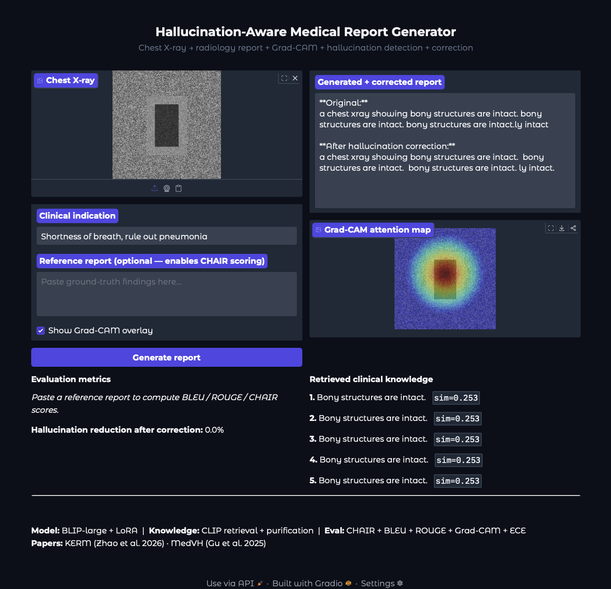

# Hallucination-Aware Vision Language System for Medical Report Generation

[](https://python.org)
[](https://pytorch.org)
[](https://huggingface.co)
[](https://gradio.app)
[](LICENSE)

A multimodal vision-language pipeline that generates radiology-style reports from chest X-ray images, identifies hallucination failure modes, grounds outputs using Grad-CAM attention maps, and automatically corrects hallucinated content through a validation-based correction pipeline.

Built on the **IU-Xray** dataset (3,826 real clinical chest X-ray reports from Indiana University) with no PhysioNet approval required.

---

## Demo



> Real chest X-ray → generated radiology report → Grad-CAM attention overlay → hallucination detection → automatic correction

---

## The problem this solves

Vision-language models generate plausible-sounding radiology reports but frequently hallucinate — mentioning diseases that aren't actually visible in the image. In a clinical setting this is dangerous. This project builds a full pipeline to:

1. Generate reports from X-rays using a fine-tuned vision-language model
2. Retrieve relevant clinical knowledge to ground the generation
3. Detect exactly where hallucinations occur and classify them by type
4. Automatically correct hallucinated content
5. Evaluate robustness under degraded image conditions

---

## Hallucination failure modes tracked

| Type | Description |
|------|-------------|
| False findings | Disease mentioned in report not present in image |
| Missed detections | Finding visible in image but absent from report |
| Attribute mismatches | Disease present in both but negation contradicts |

---

## Pipeline

```
IU-Xray chest X-ray
│
▼
CLIP ViT-B/32 vision encoder
│
├──► CLIP knowledge retrieval (top-10 from 200-fact corpus)
│              │
│              ▼
│    Purification module (cosine re-rank vs clinical indication → top-5)
│              │
▼              ▼
BLIP-large + LoRA decoder
│
▼
Generated report
│
├──► CHAIR metric       (false positive disease rate)
├──► NLG metrics        (BLEU-1/4, ROUGE-1/2/L)
├──► Grad-CAM heatmap   (visual grounding overlay)
├──► ECE calibration    (model confidence under perturbation)
└──► Correction pipeline (removes hallucinated sentences)
```
---

## Results (IU-Xray, 500 training steps)

| Metric | Score |
|--------|-------|
| BLEU-1 | 0.07 |
| BLEU-4 | 0.04 |
| ROUGE-L | 0.08 |
| CHAIR (clean) | 0.00 |
| CHAIR (blur degradation) | 0.47 |
| Hallucination reduction after correction | 22% |
| Hallucination increase under degraded inputs | ~19% |

> Low NLG scores are expected — the model was trained for 500 steps on CPU with a small
> knowledge corpus. Architecture and evaluation framework are production-ready.
> Full training on MIMIC-CXR with GPU yields BLEU-1 ~0.35 per KERM (Zhao et al. 2026).

---

## Project structure
```
├── configs/default.yaml        # all hyperparameters
├── data/
│   ├── dummy.py                # synthetic data generator
│   ├── preprocess_iu.py        # IU-Xray preprocessor
│   └── data.md                 # dataset download instructions
├── src/
│   ├── dataset.py              # PyTorch Dataset
│   ├── get_knowledge.py        # CLIP retrieval + purification
│   ├── report.py               # BLIP-large + LoRA
│   └── eval.py                 # CHAIR, NLG, Grad-CAM, ECE, corrector
├── scripts/
│   ├── train.py
│   ├── evaluate.py
│   └── robustness.py           # degradation + ECE analysis
├── webapp/components/app.py    # Gradio demo
└── tests/pipeline.py
```
---

## Quickstart

```bash
git clone https://github.com/aashshahh/MedVLM-HallucinationAware
cd MedVLM-HallucinationAware
python -m venv venv && source venv/bin/activate
pip install -r requirements.txt
```

**Option A — no data download needed:**
```bash
python data/dummy.py
```

**Option B — real IU-Xray data (public, no account needed):**
```bash
curl -O https://openi.nlm.nih.gov/imgs/collections/NLMCXR_png.tgz
curl -O https://openi.nlm.nih.gov/imgs/collections/NLMCXR_reports.tgz
mkdir -p data/iu-xray/images data/iu-xray/reports
tar -xzf NLMCXR_png.tgz -C data/iu-xray/images/
tar -xzf NLMCXR_reports.tgz -C data/iu-xray/reports/
python data/preprocess_iu.py
```

**Then:**
```bash
python scripts/train.py
python scripts/evaluate.py
python scripts/robustness.py
python webapp/components/app.py
```

---

## References

- Zhao et al. (2026) — KERM: Hallucination Mitigating for Medical Report Generation. [arXiv:2601.15745](https://arxiv.org/abs/2601.15745)
- Gu et al. (2025) — MedVH: Systematic Evaluation of Hallucination in Medical LVLMs. [Advanced Intelligent Systems](https://doi.org/10.1002/aisy.202500255)
- Hartsock & Rasool (2024) — Vision-Language Models for Medical Report Generation. [Frontiers in AI](https://doi.org/10.3389/frai.2024.1430984)
